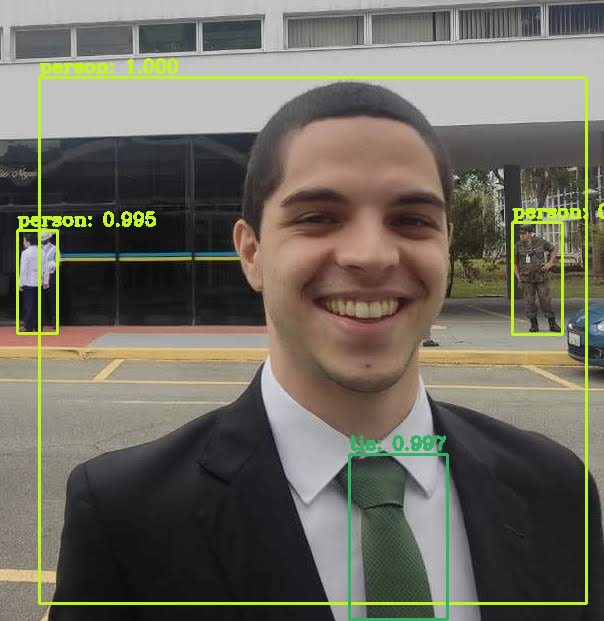

# YOLOv3

The goal of this repository is to consolidate the knowledge regarding application of pre trained YOLOv3 to pictures and videos. Moreover, a future task is the training of a custom model, which is able to identify objects of my own interest.

BEFORE:

AFTER:

